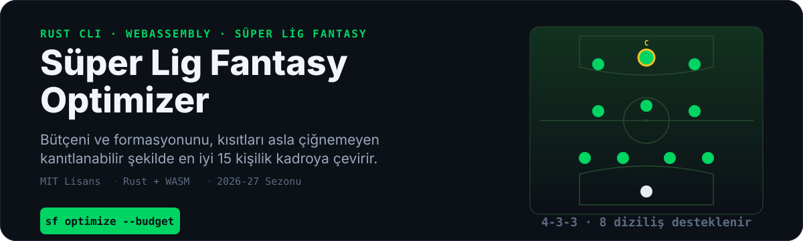
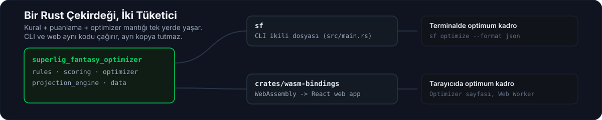
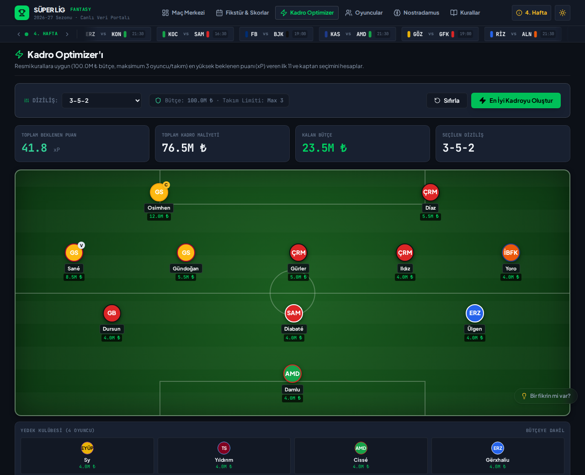
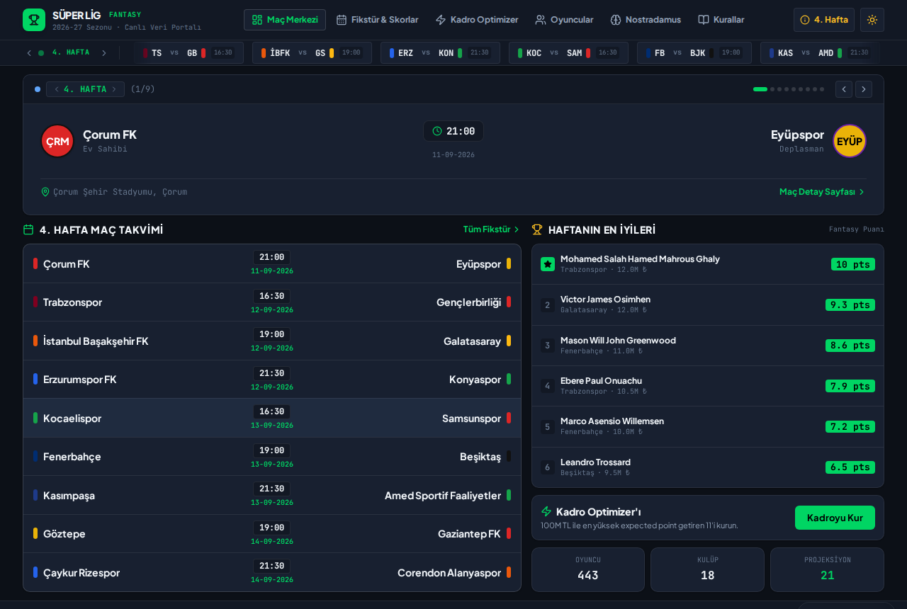

<p align="center">
  
</p>

<p align="center">
  <strong>Deterministik Branch-and-Bound Algoritması ile Daraltılmış Aday Havuzunda En İyi 15 Kişilik Kadro Çözücü</strong>
</p>

<p align="center">
  <a href="https://superlig-fantasy-optimizer.web.app"></a>
  <a href="https://buymeacoffee.com/barissalihv"></a>
  <a href="https://github.com/barissalihbabacan/superlig-fantasy-optimizer/actions/workflows/ci.yml"></a>
  <a href="LICENSE"></a>
</p>

<p align="center">
  
  
  
  
  
  
  
</p>

<p align="center">
  <a href="#-neden-süper-lig-fantasy-optimizer">Özellikler</a> •
  <a href="#-mimari-bir-rust-çekirdeği-iki-tüketici">Mimari</a> •
  <a href="#-hızlı-başlangıç--cli-kullanımı">CLI Kullanımı</a> •
  <a href="#-kadro-kuralları--puanlama">Kadro Kuralları</a> •
  <a href="#-veri-seti-ve-kaynaklar">Veri Seti</a> •
  <a href="#-bağımsızlık-ve-yasal-uyarı">Yasal Uyarı</a>
</p>

---

## ⚡ Neden Süper Lig Fantasy Optimizer?

Pek çok fantezi futbol aracı basit bir *"en yüksek puanlıdan düşüğe doğru sırala"* (greedy) yaklaşımıyla çalışır. Bu yöntem bütçe ve pozisyon kısıtları altında **yanlış ve suboptimal** sonuçlar üretir. 

**Süper Lig Fantasy Optimizer (`sf`)**, bütçe, takım limiti (kulüp başına max 3 oyuncu) ve formasyon kısıtlarını çiğnemeden **her pozisyon için en güçlü ve en ucuz adaylardan oluşan daraltılmış bir havuz üzerinde milisaniyeler içinde tüm kombinasyonları deneyen deterministik bir Branch-and-Bound algoritması** çalıştırır:

* 🎯 **Daraltılmış Havuzda En İyi Sonuç:** Greedy tahminler yerine, her pozisyonun en yüksek projeksiyonlu ve en ucuz adaylarından oluşturulan aday havuzu içinde kısıtlar altında en yüksek toplam xP'yi (beklenen puan) arar. Gerçek oyuncu havuzu (ör. 180+ orta saha) hesaplama süresi nedeniyle tam olarak taranmaz, bu yüzden sonuç mutlak küresel optimum garantisi taşımaz — bkz. [Kadro Kuralları](#-kadro-kuralları--puanlama) altındaki not.
* 🚀 **Sıfır Sunucu Maliyeti / İstemci Taraflı (Client-Side):** Ağır kombinatoryal optimizasyon sunucuda değil, kullanıcının tarayıcısında WebAssembly + Web Worker üzerinde donma yapmadan çalışır.
* 🛡️ **Kurgusuz ve Dürüst Veri:** Tahmini puanlar rastgele uydurulmaz; oyuncunun son 5 maçlık ağırlıklı gerçek saha istatistiklerinden (`[1, 2, 3, 4, 5]` form çarpanı) hesaplanır.

---

## 📊 Örnek Çözüm (Benchmark)

Gerçek 2026-27 sezon veri setiyle, CLI üzerinden tek komutla üretilen 15 kişilik kadro çözümü örneği:

```text
$ sf optimize --budget 10000 --formation 4-3-3

BEST SQUAD
══════════════════════════════════════════════════════════════════════
Budget: 100.0M TL (10000)   │ Cost: 76.5M TL (7650)   │ Remaining: 23.5M TL
Formation: 4-3-3            │ Expected Points: 49.0 pts
──────────────────────────────────────────────────────────────────────
STARTING XI
  [GK]   Marcos Felipe de Freitas Monteiro  (4.0M)   2.0 pts
  [DEF]  Abdurrahim Dursun                  (4.0M)   0.0 pts
  [DEF]  Ali Badra Diabaté                  (4.0M)   0.0 pts
  [DEF]  Ali Ülgen                          (4.0M)   0.0 pts
  [DEF]  Amadou Cissé                       (4.0M)   0.0 pts
  [MID]  Leroy Aziz Sané                    (8.5M)   7.0 pts
  [MID]  Serdar Gürler                      (5.0M)   5.0 pts
  [MID]  İlkay Gündoğan                     (5.5M)   2.0 pts
  [FWD]  Victor James Osimhen (C)          (12.0M)  13.0 pts [x2 Kaptan]
  [FWD]  Jesús Andrés Ramírez Díaz (VC)     (5.5M)   7.0 pts
  [FWD]  Abdou Khadre Sy                    (4.0M)   0.0 pts

BENCH
  1. Abdoulaye Serge Marc Dylan Yoro (DEF)
  2. Abdulsamed Damlu                (GK)
  3. Alexandre Matos                 (MID)
  4. Amar Gërxhaliu                  (DEF)
══════════════════════════════════════════════════════════════════════
✓ 15/15 oyuncu kurallara uygun · Takım başına max 3 oyuncu kuralı sağlandı.
```

---

## 🧠 Mimari: Bir Rust Çekirdeği, İki Tüketici

Kural seti, puanlama motoru, projeksiyon hesaplaması ve branch-and-bound çözücüsü tek bir Rust crate'inde yaşar. Hem CLI aracı hem de web arayüzü aynı kod tabanını doğrudan çalıştırır; aralarında mantık farkı veya mükerrer kod yoktur.

<p align="center">
  
</p>

```
superlig-fantasy-optimizer/
├── src/
│   ├── rules.rs              # Fantezi puanlama ve kadro kısıt kuralları
│   ├── scoring.rs            # Maç istatistiklerinden fantezi puanı üretimi
│   ├── projection_engine.rs  # Son 5 maç ağırlıklı form & xP projeksiyon motoru
│   ├── optimizer.rs          # Deterministik Branch-and-Bound kadro çözücü
│   ├── data/                 # JSON modelleri, doğrulama ve veri yükleyici
│   └── main.rs               # sf CLI ikili dosyası
├── crates/wasm-bindings/     # wasm-bindgen ile derlenen WebAssembly motoru
├── web/                      # React 18, TypeScript, Tailwind & Web Worker UI
└── data/2026-27/             # 18 takım, 440+ oyuncu, 306 maçlık sezon veri seti
```

---

## 🌐 Canlı Demo & Özellikler

Uygulama [https://superlig-fantasy-optimizer.web.app](https://superlig-fantasy-optimizer.web.app) adresinde yayındadır. Aşağıdaki iki görsel, kurgusal bir mockup değil — canlı üretim sitesinden alınmış gerçek ekran görüntüleridir.

<p align="center">
  
  <br>
  <sub><strong>Kadro Optimizer</strong> — tek tıkla üretilen 3-5-2 diziliş: toplam xP, kadro maliyeti ve kalan bütçe üstte, kaptan/vice-kaptan sahada işaretli.</sub>
</p>

<p align="center">
  
  <br>
  <sub><strong>Maç Merkezi</strong> — güncel haftanın fikstürü, canlı skor şeridi ve haftanın en iyi fantezi puanlı oyuncuları.</sub>
</p>

| Modül | Açıklama |
| :--- | :--- |
| ⚡ **Kadro Optimizer** | 8 farklı formasyon (`3-5-2`, `4-3-3`, `4-4-2` vb.), bütçe seçimi, oyuncu kilitleme/çıkarma ve anında en iyi 15'li kadro çıktısı. |
| 🔮 **Nostradamus** | Haftalık maç tahminleri, gol olasılıkları, form endeksleri ve geçmiş tahmin doğruluk istatistikleri. |
| 🏟️ **Canlı Maç & Fikstür** | 34 haftalık Süper Lig fikstürü, Sofascore detaylı maç istatistikleri ve resmî beIN SPORTS geniş maç özetleri. |
| 📊 **Projeksiyon & Oyuncular** | Takım ve mevkilerine göre filtrelenebilir oyuncu listesi, fiyatlar ve tarihsel performans grafikleri. |
| 🛡️ **İstemci Taraflı Gizlilik** | Kadro ve tahminleriniz sunucuya gönderilmez; tamamen tarayıcınızın `IndexedDB` / `localStorage` belleğinde kalır. |

---

## 🚀 Hızlı Başlangıç & CLI Kullanımı

### Gereksinimler
* [Rust & Cargo](https://rustup.rs/) (1.80+)

### Kurulum

```bash
# Depoyu klonlayın
git clone https://github.com/barissalihbabacan/superlig-fantasy-optimizer.git
cd superlig-fantasy-optimizer

# sf CLI ikilisini derleyin ve kurun
cargo install --path .

# Kurulumu doğrulayın
sf version
```

### Temel Komutlar

```bash
# 100.0M bütçe ile 3-5-2 formasyonunda en iyi kadroyu bul
sf optimize --budget 10000 --formation 3-5-2

# JSON çıktısı al (Otomasyon ve pipeline'lar için)
sf optimize --budget 10000 --formation 4-3-3 --format json

# Desteklenen formasyonları listele
sf formation list

# Oyuncu projeksiyon istatistiklerini görüntüle
sf projection stats

# Veri setinin bütünlüğünü ve kısıtlarını doğrula
sf validate data/2026-27/players.json
```

---

## 📋 Kadro Kuralları & Puanlama

### Kadro Kısıtları

| Kısıt | Değer | Kural Açıklaması |
| :--- | :---: | :--- |
| **Kadro Genişliği** | 15 Oyuncu | 2 Kaleci (GK), 5 Defans (DEF), 5 Orta Saha (MID), 3 Forvet (FWD) |
| **İlk 11 / Yedek** | 11 / 4 | Starting XI seçilen formasyona göre belirlenir, 4 oyuncu yedek kalır |
| **Kulüp Limiti** | Max 3 | Aynı Süper Lig takımından en fazla 3 oyuncu seçilebilir |
| **Bütçe Birimi** | 100.0M TL | Fiyat çarpanı: `10000` = 100.0M TL |
| **Kaptan Çarpanı** | 2x | Seçilen kaptanın beklenen puanı 2 ile çarpılır |

> [!NOTE]
> **Kadro çözücüsü hakkında:** `sf optimize`, her pozisyonun tüm gerçek adaylarını (ör. 180+ orta saha) değil; en yüksek projeksiyonlu ve en ucuz adaylardan oluşan daraltılmış bir havuzu (kulüp başına en fazla 2 aday) tam/deterministik biçimde arar. Bu, milisaniyeler içinde yanıt vermesini sağlar ama sonucun tüm oyuncu evreni üzerinde matematiksel küresel optimum olduğunu garanti etmez — orta fiyatlı/orta projeksiyonlu bir oyuncu havuza hiç girmeyebilir. Buna karşılık, sabit 15 kişilik bir kadrodan en iyi ilk 11'i seçen `recommend_lineup` / `recommend_lineup_for_formation` tüm kombinasyonları dener ve gerçekten optimaldir.

### Puanlama Matrisi (Scoring Matrix)

```text
Olay                         GK    DEF    MID    FWD
────────────────────────────────────────────────────
60+ Dakika Oynama            +2     +2     +2     +2
Gol Atma                    +10     +6     +5     +4
Asist                        +3     +3     +3     +3
Clean Sheet (Golsüz Maç)     +4     +4     +1      0
Her 3 Kurtarış               +1      -      -      -
Penaltı Kurtarma             +5      -      -      -
Yenilen Her 2 Gol            -1     -1      0      0
Sarı Kart / Kırmızı Kart   -1/-3  -1/-3  -1/-3  -1/-3
Kendi Kalesine Gol           -2     -2     -2     -2
```

---

## 🛠️ Geliştirme & Test

Tüm test paketini, lint denetimlerini ve WebAssembly derlemesini çalıştırmak için:

```bash
# Rust test paketi (79 test)
cargo test

# Kod stili ve clippy denetimi
cargo fmt --check
cargo clippy --all-targets --all-features -- -D warnings

# Web test paketi (Vitest - 39 test)
npm test

# WebAssembly ve Vite üretim paketi derleme
npm run build
```

---

## 📁 Veri Seti ve Kaynaklar

Veri seti `data/2026-27/` dizini altında versiyonlanmış JSON formatında tutulmaktadır:
* `teams.json`: 18 Süper Lig kulübü, renk kodları ve stadyum bilgileri.
* `players.json`: 440+ oyuncu, mevkiler ve bütçe fiyatlandırmaları.
* `fixtures.json`: 34 haftalık resmî maç takvimi, başlama saatleri ve özet bağlantıları.
* `matches/`: Hafta hafta tamamlanan maçların detaylı oyuncu istatistikleri (Sofascore & kamuya açık kaynaklar).

> [!NOTE]
> Projede TFF veya üçüncü taraf platformlara yönelik otomatik scraping / bot bulunmamaktadır. Maç sonuçları ve takvim TheSportsDB, Wikipedia MediaWiki API ve kamuya açık kaynaklar üzerinden doğrulanarak manuel/yarı-otomatik işlenmektedir.

---

## ⚖️ Bağımsızlık ve Yasal Uyarı

* **Bağımsızlık:** Süper Lig Fantasy Optimizer; **Türkiye Futbol Federasyonu (TFF), TFF Dijital Ligler Teknoloji A.Ş., Trendyol Süper Lig veya TFF Fantezi Lig ile herhangi bir resmî bağı, ortaklığı, sponsorluğu veya kurumsal ilişkisi olmayan bağımsız ve açık kaynaklı bir topluluk projesidir.**
* **Marka Kullanımı:** Uygulamada geçen lig, kulüp ve oyuncu adları yalnızca içeriği tanımlamak ve referans vermek amacıyla kullanılmıştır. Resmî logolar veya tescilli kurumsal görseller kullanılmamaktadır.
* **Tavsiye Niteliği:** Üretilen kadro ve puan projeksiyonları matematiksel birer karar destek önerisidir; sportif veya finansal başarı garantisi ya da bahis tavsiyesi içermez.

---

## 📄 Lisans

Bu projenin kaynak kodları [MIT Lisansı](LICENSE) altında sunulmaktadır. Proje içerisindeki kamuya açık spor verileri ve üçüncü taraf referansları ilgili hak sahiplerine aittir.

**Geliştirici:** [Barış Salih Babacan](https://github.com/barissalihbabacan) • İletişim: `barissalihbabacan@gmail.com`
